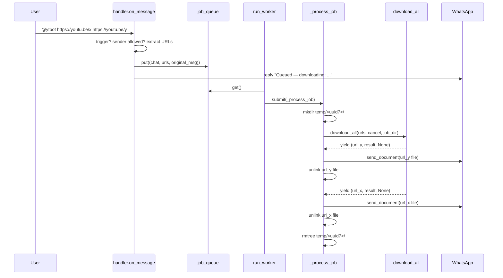

# Architecture

This document describes how the yt-bot is structured internally — the threading model, control flow, and how components coordinate.

## High-level view

```
┌────────────┐   WhatsApp   ┌─────────────────┐
│ User phone │ ───────────→ │  neonize client │
└────────────┘              │   (Go runtime)  │
                            └────────┬────────┘
                              MessageEv │
                                       ▼
                            ┌─────────────────┐
                            │    handler      │  filters by sender,
                            │   on_message    │  trigger (`@ytbot`),
                            └────────┬────────┘  extracts URLs
                                     │
                                     │ enqueue
                                     ▼
                              ┌─────────────┐
                              │  job_queue  │  bounded by MAX_QUEUE_SIZE
                              └──────┬──────┘
                                     │
                                     ▼
                            ┌─────────────────┐
                            │     worker      │  pool of MAX_CONCURRENT_JOBS
                            │   run_worker    │  consumers
                            └────────┬────────┘
                                     │ submit
                                     ▼
                            ┌─────────────────┐
                            │   _process_job  │  per-job temp dir
                            └────────┬────────┘  download & upload pipeline
                                     │
                          ┌──────────┴──────────┐
                          ▼                     ▼
                  ┌──────────────┐      ┌──────────────┐
                  │ download_all │      │ send_document│
                  │  (yt-dlp)    │      │  (neonize)   │
                  └──────────────┘      └──────────────┘
```

## Modules

| Module | Responsibility |
|---|---|
| `bot.py` | Process entry point: argparse, temp cleanup, neonize client wiring, signal handling, graceful shutdown |
| `handler.py` | Inbound `MessageEv` filtering: group skip, allowlist, `@ytbot` trigger, URL extraction (own message + quoted) |
| `worker.py` | Job-queue consumer, per-job lifecycle, `ShutdownContext` for cross-thread cancellation |
| `downloader.py` | yt-dlp wrapper, share.google resolution, retry-with-backoff, per-attempt timeout, oEmbed title fetch |
| `config.py` | Settings with `.env` overrides via `python-dotenv` |
| `logger.py` | Logging setup |

## Threading model

The process runs five distinct kinds of threads:

```
Main thread          ─ holds signal handler; blocks on stop event
neonize Go runtime   ─ daemon thread running client.connect() (blocking)
Worker dispatcher    ─ daemon thread running run_worker() loop
Job pool workers     ─ ThreadPoolExecutor, MAX_CONCURRENT_JOBS slots
  └── Job timer      ─ sub-executor (1 worker) per job, drives JOB_TIMEOUT
        └── Download pool ─ MAX_CONCURRENT_DOWNLOADS slots, parallel URLs
              └── Attempt timer ─ sub-executor per attempt, drives DOWNLOAD_ATTEMPT_TIMEOUT
```

Daemon threads exist so the main thread stays free to receive `SIGINT`. The neonize Go runtime ignores Python signals, which is why `bot.main` runs `client.connect()` in a separate thread rather than the main thread.

## Job lifecycle



### Phases of one job

1. **Setup**: register a `cancel: threading.Event` with `ShutdownContext`, create per-job temp dir (named with `uuid7().hex` so listings sort chronologically).
2. **Download**: `download_all` is a generator that yields `(url, result, error)` in completion order. Up to `MAX_CONCURRENT_DOWNLOADS` URLs run in parallel via a `ThreadPoolExecutor` and `as_completed`.
3. **Upload (interleaved)**: each yielded successful result is uploaded immediately via `client.send_document`. Other downloads continue in the background during the upload — this is why the user-perceived latency for the first video is bounded by `download_time(fastest URL) + upload_time`, not the slowest URL.
4. **Cleanup**: each file is `unlink`ed in a `finally` right after upload. The entire job dir is `rmtree`'d in the outer `finally`, catching anything missed (orphan writes from per-attempt-timeout zombies, downloaded-but-unsent files left behind by a cancel).

## Per-URL pipeline

```
download_all submits each URL ─→ _download_sync (retry loop)
                                        │
                                        ▼
                          ┌───────────────────────────┐
                          │  for attempt in 1..MAX:   │
                          │    _run_attempt_with_     │
                          │      timeout(...)         │
                          │      ├─ success → return  │
                          │      ├─ permanent → raise │
                          │      └─ transient → wait  │
                          │           backoff, retry  │
                          └───────────────────────────┘
                                        │
                                        ▼
                          _run_attempt_with_timeout
                                        │
                                        │ submits to sub-executor
                                        ▼
                                _download_once
                                        │
                                        │ progress_hook checks _AnyEvent(parent_cancel,
                                        │                                attempt_cancel)
                                        ▼
                                yt-dlp downloads
```

### Error classification (`_is_permanent_error`)

| Substring (case-insensitive) | Treated as |
|---|---|
| `private`, `unavailable`, `removed` | Permanent (skip retry) |
| `geo`, `not available in your country` | Permanent |
| `unsupported url`, `not a valid url` | Permanent |
| anything else | Transient (retry with backoff) |

Permanent errors fail fast because no amount of retrying will recover them. Transient errors (rate limits, network blips, 5xx responses) are retried with backoffs from `DOWNLOAD_RETRY_BACKOFFS`.

### Timeout layers

Three nested wall-clock budgets bound a single URL:

| Timeout | Default | Scope |
|---|---|---|
| `socket_timeout` (yt-dlp opt) | 30s | One TCP read |
| `DOWNLOAD_ATTEMPT_TIMEOUT` | 600s | One full `_download_once` invocation |
| `JOB_TIMEOUT` | 1800s | Entire job (all URLs, all attempts) |

When the per-attempt timeout fires, the future is abandoned but the underlying yt-dlp thread keeps running until its next `progress_hook` tick — at which point the per-attempt cancel event causes it to raise `DownloadCancelled` and unwind. Meanwhile, the retry loop has already started attempt N+1.

### Why `_AnyEvent`

`progress_hook` needs to honor two independent cancel sources at once:

1. The **parent cancel** (job timeout / shutdown) — should abort and not retry
2. The **per-attempt cancel** (set when attempt timeout fires) — should abort but allow retry

`_AnyEvent(parent, attempt)` exposes a single `is_set()` that's true if either is. The retry loop distinguishes between them by checking `cancel.is_set()` (parent) inside the `FuturesTimeoutError` handler — if the parent was set, it raises `DownloadCancelled`; otherwise it falls through to retry.

## Cancellation & graceful shutdown

`ShutdownContext` (in `worker.py`) is the coordination primitive:

```python
class ShutdownContext:
    shutdown:    threading.Event   # set when bot is shutting down
    _active:     set[threading.Event]  # one per in-flight job
    _lock:       threading.Lock

    def register(cancel)     # called at job start
    def unregister(cancel)   # called at job end
    def cancel_all()         # sets shutdown + every active cancel
    def has_active()         # True if any job is still running
```

### Shutdown flow

```
SIGINT ──→ handle_signal()
            ├─ if stop already set → os._exit(130)  [second Ctrl+C]
            └─ otherwise:
                 ctx.cancel_all()        # set shutdown + all per-job cancels
                 stop.set()              # release main thread

main thread resumes:
  while ctx.has_active() and time.monotonic() < deadline:
      time.sleep(0.2)            # 10s grace window
  os._exit(0)
```

Why `os._exit(0)`? Python's `ThreadPoolExecutor` registers an `atexit` hook that waits for in-flight futures to complete. yt-dlp's network code is in C and ignores signals, so a normal interpreter shutdown would block indefinitely. `os._exit` skips `atexit` and hard-terminates the process — daemon threads (including the Go runtime) die with it.

The grace window gives in-flight downloads a chance to abort cleanly via `progress_hook` raising `DownloadCancelled`, ensuring partial files end up in the per-job temp dir which gets `rmtree`'d in the job's `finally` — *before* `os._exit` fires.

## Disk hygiene

Three layers of temp cleanup, all idempotent:

1. **Per-file**: `_process_job` `unlink`s each file immediately after upload, in a `finally` block.
2. **Per-job**: `_process_job` outer `finally` runs `shutil.rmtree(job_dir, ignore_errors=True)`, catching partials, orphan writes, and downloaded-but-unsent files.
3. **Per-process startup**: `bot.main` wipes `TEMP_DIR/` on launch, catching anything missed by a crashed/killed previous run.

Each download uses a `uuid7().hex` filename within its job dir, so concurrent downloads can't collide and `ls temp/<job>/` lists files in creation order.

## Message handling rules

Implemented in `handler.on_message` (in this order):

1. **Group messages** are dropped. (Could be relaxed via config.)
2. **Sender allowlist**: must be in `ALLOWED_SENDERS` *unless* the message is `IsFromMe` (i.e. the bot's own account, used when you message yourself or another chat from the linked phone).
3. **Trigger required**: the sender's text must contain `@ytbot` (case-insensitive, word-bounded). Bare links don't trigger downloads.
4. **URL extraction** scans both the sender's message and any quoted message — supports replies where the link sits in the quoted message.
5. **Queue full**: if `job_queue.qsize() == MAX_QUEUE_SIZE`, replies "I'm currently busy" instead of enqueueing.
6. Otherwise enqueues and replies with the queued titles (fetched via YouTube oEmbed).

## Configuration override chain

```
defaults in config.py  ←  overridden by  ←  .env  ←  shell env vars
```

`config.py` reads `os.environ.get(KEY)` for each setting; `python-dotenv`'s `load_dotenv()` populates `os.environ` from `.env` at import time. Shell environment variables that are set before launch take priority over `.env`, since dotenv won't overwrite existing keys by default.

## Test layout

```
tests/
  test_regex.py       # _TRIGGER_RE, _YOUTUBE_RE, _SHARE_GOOGLE_RE
  test_handler.py     # message routing, allowlist, trigger, queue-full path
  test_downloader.py  # _friendly_error, _is_permanent_error, retry/timeout, share.google
  test_worker.py      # ShutdownContext register/unregister/cancel_all
```

Tests mock `_download_once` and `urllib.request.urlopen` at boundaries — no real network, no yt-dlp execution. The neonize `MessageEv` shape is replicated using `SimpleNamespace` to avoid mocking the protobuf-derived types.
